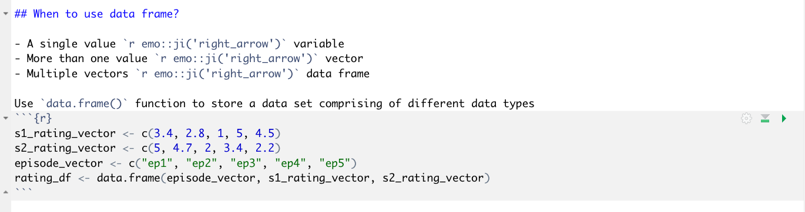
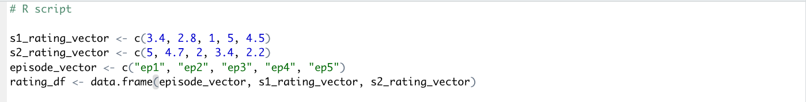
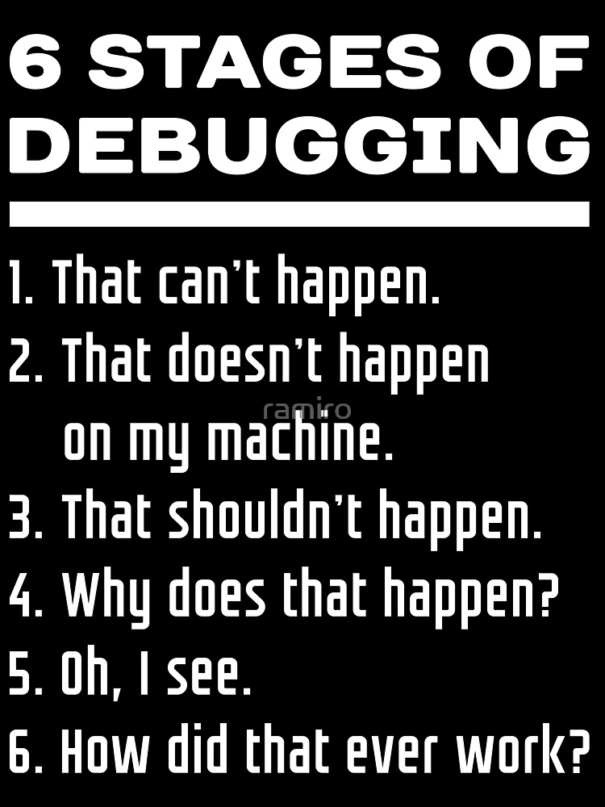
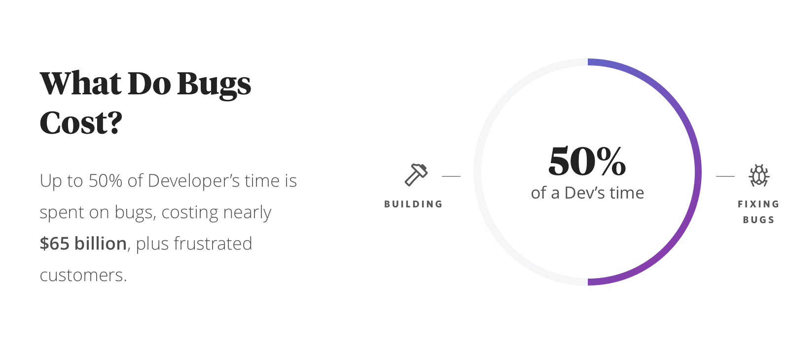
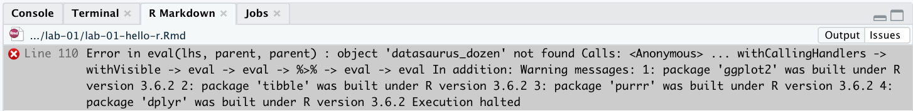
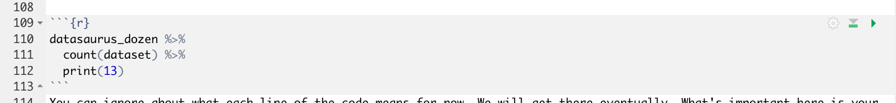
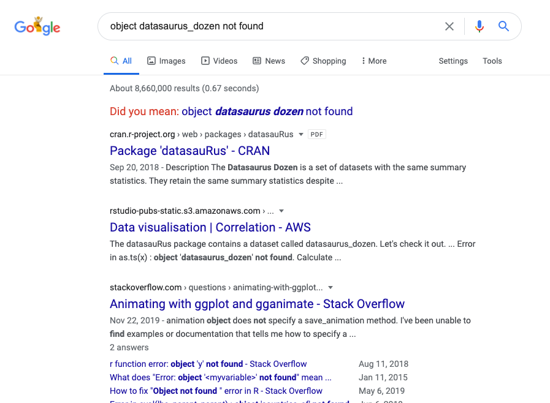
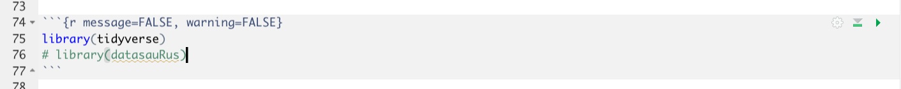

```{r child = "../setup.Rmd"}
```

```{r packages, echo=FALSE, message=FALSE, warning=FALSE}
library(fontawesome)
```

class: center, middle

# R and RStudio

---

## What is R/RStudio?

- R is a statistical programming language
- RStudio is an interface for R (an integrated development environment, IDE)

```{r fig.align="center", echo=FALSE}
knitr::include_graphics("img/engine-dashboard.png")
```

.footnote[
Source: [Modern Dive](https://moderndive.com/)
]

---

## Let's take a tour - RStudio

```{r fig.align="center", echo=FALSE, alt="rstudio", out.width="90%"}
knitr::include_graphics("img/rstudio-anatomy.png")
```

---

## Three essentials: Variable, function, package

A short list (for now):

- Variables or columns in data frames are accessed with `$`:

.small[
```{r eval=FALSE}
dataframe$var_name
```
]
--

- Functions are (most often) verbs, followed by what they will be applied to in parantheses:

.small[
```{r eval=FALSE}
do_this(to_this)
do_that(to_this, to_that, with_those)
```
]

--

- Packages are installed with the `install.packages` function and loaded with the `library` function, once per session:

.small[
```{r eval=FALSE}
install.packages("package_name")
library(package_name)
```
]

---

class: center, middle

# Hello R

---

<!-- <iframe width="1280" height="720" src="https://www.youtube.com/embed/3kyvYhbM24E?start=46&end=64" frameborder="0" allow="accelerometer; autoplay; encrypted-media; gyroscope; picture-in-picture" allowfullscreen></iframe> -->

<iframe width="800" height="600" src="https://www.youtube.com/embed/3kyvYhbM24E?start=46&end=65"></iframe>

---

## What's 12*157?

Go into the console and Enter `12*157`

.small[
```{r}
12*157
```
]

You can use R console as a simple calculator. Try the following:

.small[
```{r}
 # A division
(5 + 5) / 2 

# Exponentiation
2^5

# Modulo
28%%6
```
]

---

## Assign value `<-`

You can assign a value to a variable and use it by referring the name. We use `<-` sign for this.

.small[
```{r}
a <- 12
b <- 157
a
b
```
]

Store the result in a variable

.small[
```{r}
c <- a*b
c
```
]

.footnote[
[What are the differences between “=” and “<-” assignment operators in R?](https://stackoverflow.com/questions/1741820/what-are-the-differences-between-and-assignment-operators-in-r)
]

---

## Data type

R can handle a variety of data including **numeric, logical, character.**

```{r}
title <- "silicon valley"
season <- 5
episode <- 4
rating <- 4.8
is_show_finished <- TRUE
```

---

## What's the data type?

Use `class()` function to find out
.small[
```{r}
class(title)
class(season)
class(rating)
class(is_show_finished)
```
]

Boolean values (TRUE or FALSE) are **logical**

---

class: middle, center

# Vector

---

## When to use vector?

To store more than one value, we need the combine function `c()` to create a vector

```{r}
numeric_vector <- c(5,6)
numeric_vector
character_vector <- c("season","episode")
character_vector
```

---

## Name vector elements `names()`

```{r}
names(numeric_vector) <- c("season", "ep")
numeric_vector
```

Or, we could use `character_vector` already defined to do the same thing
```{r}
names(numeric_vector) <- character_vector
numeric_vector
```

Notice the name of the second column has changed from "ep" to "episode"

---

## Calculation between two vectors

We can do arithmetic calculations on vectors


```{r}
s1_rating_vector <- c(3.4, 2.8, 1, 5, 4.5)
s2_rating_vector <- c(5, 4.7, 2, 3.4, 2.2)
episode_vector <- c("ep1", "ep2", "ep3", "ep4", "ep5")
names(s1_rating_vector) <- episode_vector
names(s2_rating_vector) <- episode_vector
s1_rating_vector + s2_rating_vector
s1_rating_vector * s2_rating_vector
```


---

## Calculation between two vectors

- Important: the numbers of elements in the vectors must be the same

```{r}
s3_rating_vector <- c(1, 3.2, 5)
s1_rating_vector + s3_rating_vector
```

---

## Calculation within a vector

```{r}
sum(s1_rating_vector) # sum
prod(s1_rating_vector) # product
mean(s1_rating_vector) # average
sd(s1_rating_vector) # standard deviation
```

---

## Compare rating by episode

```{r}
s1_rating_vector > s2_rating_vector
```

```{r}
s1_rating_vector < s2_rating_vector
```

```{r}
s1_rating_vector == s2_rating_vector
```

- `>`, `<`, `==` are called **logical comparison operator**. More on this later!

---

.question[What's the average rating for each season?]

--

.small[
```{r}
s1_mean_rating <- mean(s1_rating_vector)
s1_mean_rating
s2_mean_rating <- mean(s2_rating_vector)
s2_mean_rating
```
]

--

.question[Is the season 1 has a higher average rating than the season 2?]

--

.small[
```{r}
is_s1_better_than_s2 <- s1_mean_rating > s2_mean_rating
is_s1_better_than_s2
```
]
--
.question[What's the data type of `is_s1_better_than_s2`?]

---

## Select vector element with index

.small[
```{r}
s1_ep1 <- s1_rating_vector[1]
s1_ep1
s1_ep3 <- s1_rating_vector[3]
s1_ep3
```
]
--
.small[
```{r}
s1_ep1_and_3 <- s1_rating_vector[c(1,3)]
s1_ep1_and_3
```
]
--
.small[
```{r}
s1_ep1_through_3 <- s1_rating_vector[1:3]
s1_ep1_through_3
```
]

---

## Select vector element with name

```{r}
s1_rating_vector
s1_ep1 <- s1_rating_vector["ep1"]
s1_ep1
s1_ep1_and_3 <- s1_rating_vector[c("ep1", "ep3")]
s1_ep1_and_3
```

---

## Select vector element with condition

.question[Which episode has rating > 4?]

```{r}
s1_rating_vector
s1_ep_above_4 <- s1_rating_vector > 4
s1_ep_above_4
s1_rating_vector[s1_ep_above_4]
```

---

class: center, middle

# Data frame

---

## When to use data frame?

- A single value `r emo::ji('right_arrow')` variable
- More than one value `r emo::ji('right_arrow')` vector
- Multiple vectors `r emo::ji('right_arrow')` data frame

Use `data.frame()` function to store a data set comprising of different data types
```{r}
s1_rating_vector <- c(3.4, 2.8, 1, 5, 4.5)
s2_rating_vector <- c(5, 4.7, 2, 3.4, 2.2)
episode_vector <- c("ep1", "ep2", "ep3", "ep4", "ep5")
rating_df <- data.frame(episode_vector, s1_rating_vector, s2_rating_vector)
```

---

## View data frame

```{r}
head(rating_df) # first part of data
str(rating_df) # structure
```

---

## Name columns

```{r}
rating_df <- data.frame(episode=episode_vector, 
                        season1=s1_rating_vector, 
                        season2=s2_rating_vector)
head(rating_df)
```

---

## Select columns

```{r}
rating_df$episode
rating_df$season1
rating_df$season2
```

- There are many ways of selecting columns & rows (more on this later!)

---

class: center, middle

# R Markdown

---

class: middle, center

<iframe src="https://player.vimeo.com/video/178485416?color=428bca" width="800" height="600" frameborder="0" allow="autoplay; fullscreen" allowfullscreen></iframe>

---

## What's R Markdown and why?

- Fully reproducible reports -- each time you knit the analysis is ran from the beginning
- Simple markdown syntax for text
- Code goes in chunks, defined by three backticks, narrative goes outside of chunks

---

## Let's take a tour - R Markdown

.center[

]

---

## R markdown document vs R script

RMD
```{r, fig.align="center", echo=FALSE, out.width="80%"}

```

R
```{r, fig.align="center",echo=FALSE, out.width="80%"}

```

- R script is simple text files for codes only
- only plain, non-formatted comments are allowed
- no html report that you can open on web browser

---

## R Markdown help

.pull-left[
.center[
[R Markdown cheat sheet](https://github.com/rstudio/cheatsheets/raw/master/rmarkdown-2.0.pdf)
]

]
.pull-right[
.center[
Markdown Quick Reference  
`Help -> Markdown Quick Reference`
]

]

---

## How will we use R Markdown?

- Every lab / instruction / tutorial is an R Markdown document
- **Homework submission** is an R Markdown document
- You'll always have a template R Markdown document to start with

---

class: center, middle

# Getting help in R

---
.pull-left[


]

.pull-right[

]
.small[
.footnote[
https://www.amazon.com/Debugging-Definition-Programming-Programmer-Computer/dp/B07PNWPHJD  
https://www.redbubble.com/i/kids-t-shirt/Six-Stages-of-Debugging-Funny-Software-Development-Design-White-Text-by-ramiro/20088521.VXRIW
]
]

---

class: middle

.small[
.footnote[https://www.fullstory.com/resources/debugging-with-session-replay/]
]

---

## Analyze error message

- Locate the codes that have caused the error

Error

Code


---

## Google it


---

## Gotcha!



---

## Reading help files
.pull-left[

.footnote[
Source: http://socviz.co/appendix.html#a-little-more-about-r
]
]

.pull-right[
Enter `?[name of function or package]`
- ?help
- ?names
- ?c
]

---

## Asking good questions

.pull-left[
- **Good:** Describe your intention and include your code and the error
- **Better:** Describe your intention and create a minimum working example
- **Best:** Write a **rep**roducible **ex**ample (reprex)
]

--

.pull-right[
- Use code formatting
- For issues with R code: copy / paste your code and resulting error, don't use screenshots 
- [Asking R questions](https://www.r-bloggers.com/asking-r-questions/#:~:text=Topics%20are%20tagged%2C%20and%20%E2%80%9Cr,%2Fquestions%2Ftagged%2Fr.)
]

---

## Wrap up

- R/Rstudio
- R essentials
  - Variable
  - Vector
  - Data frame
- R markdown
- Get help

<!-- ## Stuff -->

<!-- - R document vs R markdown document  -->
<!-- - Commenting in R vs RMD doc -->
<!-- - Run vs. Knit -->
<!-- - Code chunk vs. Narrative -->
<!-- - Console vs. Terminal -->
<!-- - Working directory -->
<!-- - Packages -->
<!-- - ?help (?[name of package]) -->

<!-- ## Factor -->

<!-- ## List -->

<!-- Wrapper -->

<!-- .small[ -->
<!-- ```{r} -->
<!-- title -->
<!-- rating_df -->
<!-- is_show_finished -->
<!-- sv_list <- list(title, rating_df, is_show_finished) -->
<!-- sv_list -->
<!-- ``` -->
<!-- ] -->

<!-- --- -->

<!-- ## select element -->

<!-- .small[ -->
<!-- ```{r} -->
<!-- sv_list[[1]] -->
<!-- sv_list[[2]] -->
<!-- sv_list[[2]][,3] -->
<!-- sv_list[[2]][2,2] -->
<!-- ``` -->
<!-- ] -->

<!-- --- -->

<!-- ## IF -->

<!-- --- -->

<!-- ## Loop -->

<!-- --- -->

<!-- ## Function -->

<!-- --- -->

<!-- ## Apply family -->

<!-- --- -->

<!-- ## Util -->

<!-- --- -->

