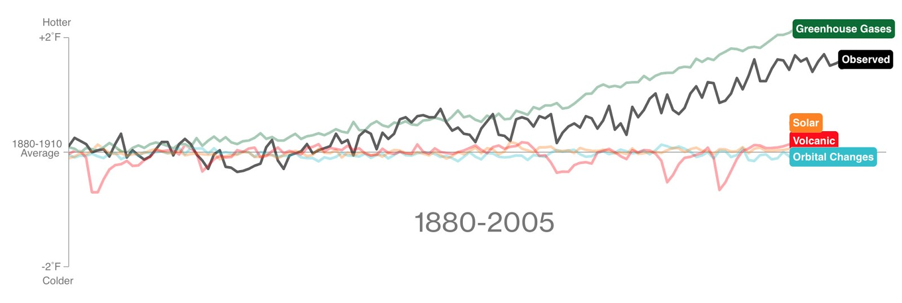
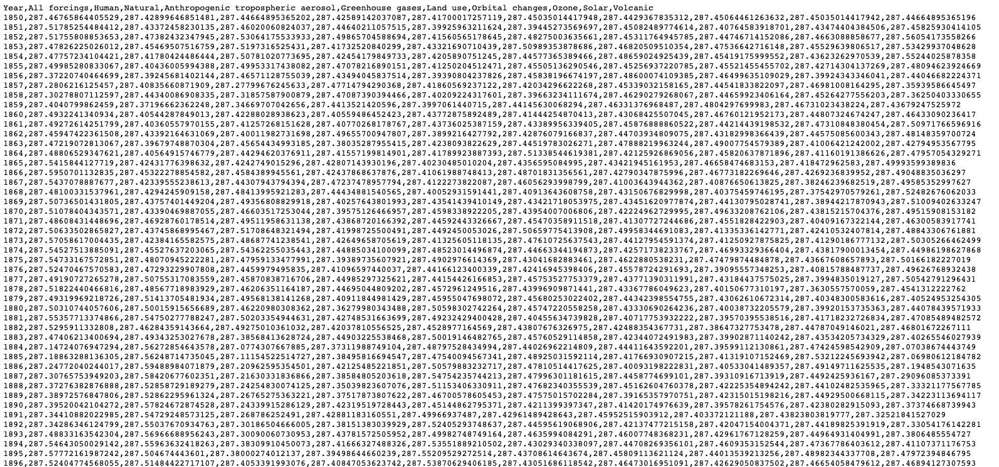
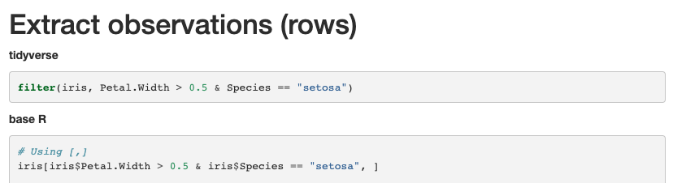
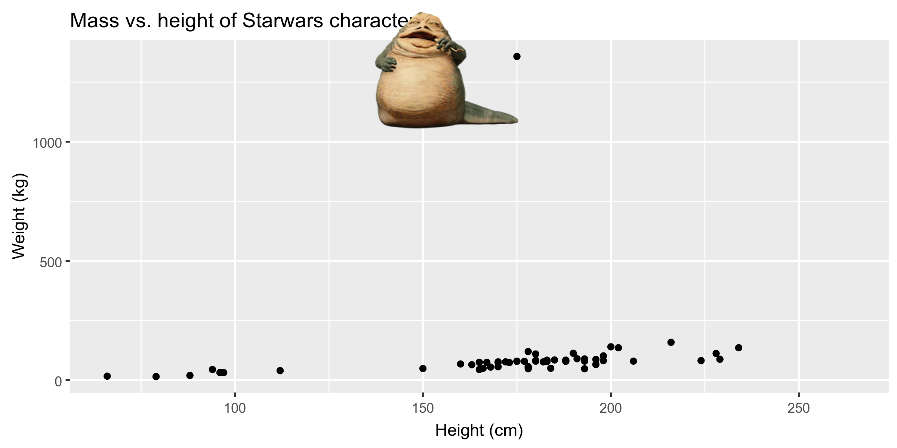

```{r child = "../setup.Rmd"}
```

```{r packages, echo=FALSE, message=FALSE, warning=FALSE}
library(emo)
library(tidyverse)
library(fontawesome)
library(magick)
```

class: center, middle

# Data visualization

---

## What's really warming the world?


  
.small[.footnote[https://www.bloomberg.com/graphics/2015-whats-warming-the-world/]]

---


  
.small[.footnote[https://www.bloomberg.com/graphics/2015-whats-warming-the-world/]]

---

## Data visualization

> *"The simple graph has brought more information to the data analyst’s mind than any other device." — John Tukey*

- The visual representation of data
- to present a **larger** amount of information
- in ways it's easier to detect **patterns** and **trends**
- There are many tools for visualizing data (R is one of them), and many approaches/systems within R for making data visualizations (ggplot2 is one of them)

---

## tidyverse

.pull-left[

]

.pull-right[
.center[
[tidyverse.org](https://www.tidyverse.org/)
]

- The tidyverse is an opinionated collection of R packages designed for data science. 
- All packages share an underlying philosophy and a common grammar. 
]

---

## Why tidyverse?

- most intuitive, consistent syntax across a large number of packages



.footnote[
[Syntax equivalents: base R vs Tidyverse](https://tavareshugo.github.io/data_carpentry_extras/base-r_tidyverse_equivalents/base-r_tidyverse_equivalents.html)
]

---

## ggplot2 $\in$ tidyverse

.pull-left[
```{r echo=FALSE, out.width="80%"}
knitr::include_graphics("img/ggplot2-part-of-tidyverse.png")
```
]
.pull-right[
- **ggplot2** is tidyverse's data visualization package
- The `gg` in "ggplot2" stands for Grammar of Graphics
- It is inspired by the book **Grammar of Graphics** by Leland Wilkinson
]

---

```{r echo=FALSE, warning=FALSE, out.width="100%"}
ggplot(data = starwars, mapping = aes(x = height, y = mass, color = gender)) + 
  geom_point() + 
  labs(
    title = "Mass vs. height of Starwars characters",
    x = "Height (cm)", 
    y = "Weight (kg)"
    )
```

---

```{r eval=FALSE}
ggplot(data = starwars, mapping = aes(x = height, y = mass, color = gender)) + 
  geom_point() + 
  labs(
    title = "Mass vs. height of Starwars characters",
    x = "Height (cm)", 
    y = "Weight (kg)"
    )
```

.question[
- What are the functions doing the plotting? 
- What is the dataset being plotted? 
- Which variable is on the x-axis and which variable is on the y-axis? 
]

---

## Hello ggplot2!

- `ggplot()` is the main function in ggplot2 
- Plots are constructed in layers
- Structure of the code for plots can be summarized as
```{r eval = FALSE}
ggplot(data = [dataset], 
       mapping = aes(x = [x-variable], y = [y-variable])) +
   geom_xxx() +
   other options
```
- To use ggplot2 functions, first load tidyverse
```{r eval = FALSE}
library(tidyverse)
```
- For help with the ggplot2, see [ggplot2.tidyverse.org](http://ggplot2.tidyverse.org/)

---

class: center, middle

# Visualizing Star Wars

---

## Dataset terminology

- Each row is an **observation**
- Each column is a **variable**

.small[
```{r message=FALSE}
starwars
```
]

---

## Luke Skywalker


---

## What's in the Star Wars data?

Take a `glimpse` at the data: 

```{r}
glimpse(starwars)
```

---

## What's in the Star Wars data?

.question[
How many rows and columns does this dataset have? What does each row represent? What does each column represent?
]

```{r eval = FALSE}
?starwars
```

```{r echo=FALSE}
knitr::include_graphics("img/starwars-help.png")
```

---

## Mass vs. height

```{r out.width="70%"}
ggplot(data = starwars, mapping = aes(x = height, y = mass))
```

---

## Mass vs. height

```{r out.width="70%"}
ggplot(data = starwars, mapping = aes(x = height, y = mass)) +
  geom_point() #<<
```

---

## What's that warning?

- Not all characters have height and mass information (hence 28 of them not plotted)

```
## Warning: Removed 28 rows containing missing values (geom_point).
```

- Going forward I'll supress the warning to save room on slides, but it's important to note it

---

## Labels

.small[
```{r out.width="70%", warning=FALSE}
ggplot(data = starwars, mapping = aes(x = height, y = mass)) +
  geom_point() +
  labs(title = "Mass vs. height of Starwars characters", #<<
       x = "Height (cm)", y = "Weight (kg)")             #<<
```
]

---

## Mass vs. height

.question[
How would you describe this relationship? What other variables would help us understand data points that don't follow the overall trend? Who is the not so tall but really chubby character?
]

.small[
```{r out.width="70%", warning=FALSE,echo=FALSE}
ggplot(data = starwars, mapping = aes(x = height, y = mass)) +
  geom_point() +
  labs(title = "Mass vs. height of Starwars characters",
       x = "Height (cm)", y = "Weight (kg)")
```
]

---

## Jabba!

```{r echo=FALSE, warning=FALSE, cache=TRUE}
jabba <- image_read("img/jabba.png")

fig <- image_graph(width = 2400, height = 1200, res = 300)
ggplot(data = starwars, mapping = aes(x = height, y = mass)) +
  geom_point(size = 1.5) + 
  labs(title = "Mass vs. height of Starwars characters",
       x = "Height (cm)", y = "Weight (kg)")
dev.off()

out <- fig %>% image_composite(jabba, offset = "+1000+30")

image_write(out, "img/jabbaplot.png", format = "png")

```

---

class: center, middle

# Aesthetics

---

## Aesthetics options

Visual characteristics of plotting characters that can be **mapped to a specific variable**
in the data are

- `color`
- `size`
- `shape`
- `alpha` (transparency)

---

## Mass vs. height + gender

```{r out.width="70%", warning=FALSE}
ggplot(data = starwars, 
       mapping = aes(x = height, y = mass, 
                     color = gender)) + #<<
  geom_point()
```

---

## Mass vs. height + age

```{r out.width="70%", warning=FALSE}
ggplot(data = starwars, 
       mapping = aes(x = height, y = mass, 
                     color = birth_year)) + #<<
  geom_point()
```

---

## Mass vs. height + gender + age

```{r out.width="70%", warning=FALSE}
ggplot(data = starwars, 
       mapping = aes(x = height, y = mass, 
                     color = gender, 
                     size = birth_year)) + #<<
  geom_point()
```

---

## Mass vs. height + gender + age

```{r out.width="70%", warning=FALSE}
ggplot(data = starwars, 
       mapping = aes(x = height, y = mass, 
                     color = birth_year,
                     shape = gender)) + #<<
  geom_point()
```

---

## Mass vs. height + gender

Let's now increase the size of all points **not** based on the values of a 
variable in the data:

```{r out.width="70%", warning=FALSE}
ggplot(data = starwars, mapping = aes(x = height, y = mass, color = gender)) +
  geom_point(size = 2) #<<
```

---

## Aesthetics summary

- Continuous variable are measured on a continuous scale
- Discrete variables are measured (or often counted) on a discrete scale

aesthetics    | discrete                 | continuous
------------- | ------------------------ | ------------
color         | rainbow of colors        | gradient
size          | discrete steps           | linear mapping between radius and value
shape         | different shape for each | shouldn't (and doesn't) work

---

class: center, middle

# Faceting

---

## Faceting

- Smaller plots that display different subsets of the data
- Useful for exploring conditional relationships and large data
- `facet_grid()`: one variable per direction
    - `rows ~ cols`
    - use `.` for no faceting

---

## For each gender, by column

.small[
```{r out.width="80%", warning=FALSE}
ggplot(data = starwars, mapping = aes(x = height, y = mass)) +
  facet_grid(. ~ gender) + #<<
  geom_point() +
  labs(title = "Mass vs. height of Starwars characters",
       subtitle = "Faceted by gender")  #<<
```
]

---

## For each gender, by row

.small[
```{r out.width="80%", warning=FALSE}
ggplot(data = starwars, mapping = aes(x = height, y = mass)) +
  facet_grid(gender ~ .) + #<<
  geom_point() +
  labs(title = "Mass vs. height of Starwars characters",
       subtitle = "Faceted by gender")  #<<
```
]

---

## For each gender (by row) and each hair_color (by column)

.small[
```{r out.width="80%", warning=FALSE}
ggplot(data = starwars, mapping = aes(x = height, y = mass)) +
  facet_grid(gender ~ hair_color) + #<<
  geom_point() +
  labs(title = "Mass vs. height of Starwars characters",
       subtitle = "Faceted by gender and hair_color")  #<<
```
]

---

## `facet_wrap()`: to specify the number of columns in graph

.small[
```{r out.width="80%", warning=FALSE}
ggplot(data = starwars, mapping = aes(x = height, y = mass)) +
  facet_wrap(gender ~ ., ncol=2) + #<<
  geom_point() +
  labs(title = "Mass vs. height of Starwars characters",
       subtitle = "Faceted by gender")  #<<
```
]

---

## Wrap-up

- ggplot2
- aesthetics
- faceting
