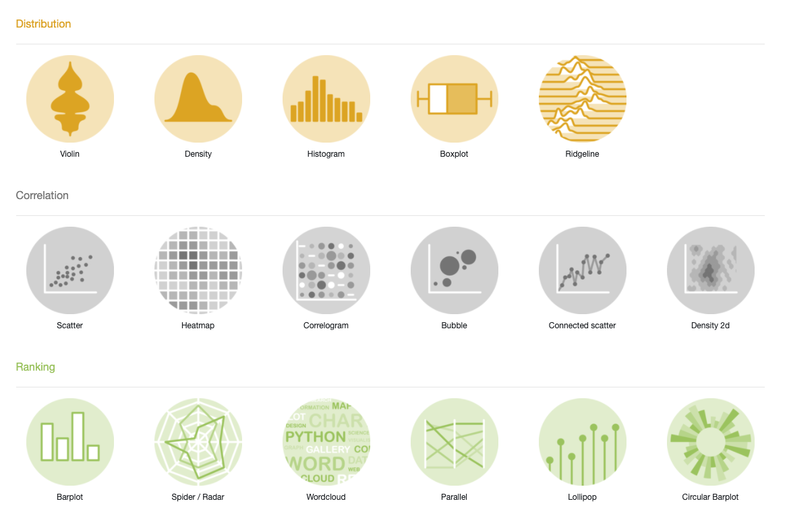

```{r child = "../setup.Rmd"}
```

```{r packages, echo=FALSE, message=FALSE, warning=FALSE}
library(tidyverse)
```


.small[
.footnote[[The R Graph Gallery](https://www.r-graph-gallery.com/index.html)]
]

---

class: center, middle

# Distribution

---

## Describing shapes of numerical distributions

* shape:
    * skewness: right-skewed, left-skewed, symmetric (skew is to the side of the longer tail)
    * modality: unimodal, bimodal, multimodal, uniform
* center: mean (`mean`), median (`median`), mode (not always useful)
* spread: range (`range`), standard deviation (`sd`), inter-quartile range (`IQR`)
* unusal observations

---

## Histograms

```{r out.width="75%", warning=FALSE}
ggplot(data = starwars, mapping = aes(x = height)) +
  geom_histogram(binwidth = 10)
```

---

## Density plots

```{r out.width="75%", warning = FALSE}
ggplot(data = starwars, mapping = aes(x = height)) +
  geom_density() #<<
```

---

## Box plots

```{r out.width="60%", warning = FALSE}
ggplot(data = starwars, mapping = aes(y = height)) +
  geom_boxplot() #<<
```

---

## Side-by-side box plots

```{r out.width="75%", warning=FALSE}
ggplot(data = starwars, mapping = aes(y = height, 
                                      x = gender)) + #<<
  geom_boxplot()
```

---

## Scatter plot...

This is not a great representation of these data.

```{r out.width="60%", warning=FALSE}
ggplot(data = starwars, mapping = aes(y = height, x = gender)) +
  geom_point()
```

---

## Violin plots

```{r out.width="75%", warning=FALSE}
ggplot(data = starwars, mapping = aes(y = height, x = gender)) +
  geom_violin()
```

---

class: center, middle

# Ranking

---

## Bar plots

```{r out.width="80%"}
ggplot(data = starwars, mapping = aes(x = gender)) +
  geom_bar()
```

---

## Segmented bar plots, counts

.small[
```{r out.width="75%"}
ggplot(data = starwars, mapping = aes(x = gender, 
                                      fill = hair_color)) + #<<
  geom_bar()
```
]

---

## Recode hair color

Using the `fct_other()` function from the **forcats** package, which is also part of the **tidyverse**.

```{r}
starwars <- starwars %>%
  mutate(hair_color2 = 
           fct_other(hair_color, 
                     keep = c("black", "brown", "blond")
                     )
         )
```

---

## Segmented bar plots, counts

```{r out.width="70%"}
ggplot(data = starwars, 
       mapping = aes(x = gender, fill = hair_color2)) +
  geom_bar() +
  coord_flip() #<<
```

---

## Grouped bar plots, counts

```{r out.width="70%"}
ggplot(data = starwars, 
       mapping = aes(x = gender, fill = hair_color2)) +
  geom_bar(position="dodge") + #<<
  coord_flip()
```

---

## Segmented bar plots, proportions

```{r out.width="70%"}
ggplot(data = starwars, 
       mapping = aes(x = gender, fill = hair_color2)) +
  geom_bar(position = "fill") +
  coord_flip() +
  labs(y = "proportion")
```

---

.question[
Which plot is a more useful representation for visualizing the relationship between gender and hair color?
]

```{r echo=FALSE, out.width="50%"}
ggplot(data = starwars, mapping = aes(x = gender, fill = hair_color2)) +
  geom_bar() +
  coord_flip()
```

```{r echo=FALSE, out.width="50%"}
ggplot(data = starwars, mapping = aes(x = gender, fill = hair_color2)) +
  geom_bar(position = "fill") +
  coord_flip() +
  labs(y = "proportion")
```

---

## Pie chart

```{r out.width="70%"}
starwars1 <- starwars %>% 
  count(gender)
ggplot(data = starwars1, 
       mapping = aes(x="", y = n, fill = gender)) +
  geom_bar(stat="identity") +
  coord_polar("y", start=0) #<<
```

---

## Pie chart, prettier

```{r out.width="70%"}
ggplot(data = starwars1, 
       mapping = aes(x="", y = n, fill = gender)) +
  geom_bar(stat="identity", color="white") + #<<
  coord_polar("y", start=0) +
  theme_void() #<< 
```

---

## Pie chart, prettier

.small[
```{r out.width="70%"}
starwars2 <- starwars %>% 
  count(hair_color2)
ggplot(data = starwars2, 
       mapping = aes(x="", y = n, fill = hair_color2)) +
  geom_bar(stat="identity", width=1, color="white") +
  coord_polar("y", start=0) +
  theme_void() +
  scale_fill_brewer(palette = "GnBu", name = "Hair Color") + #<<
  labs(title = "Hair color of Starwars characters")
```
]

---

## Pre-set color variation

- `scale_*_brewer` for discrete scale (https://ggplot2.tidyverse.org/reference/scale_brewer.html)
  - `scale_colour_brewer`
  - `scale_fill_brewer`
- `scale_*_gradient` for continuous scale (https://ggplot2.tidyverse.org/reference/scale_gradient.html)
  - `scale_colour_gradient`
  - `scale_fill_gradient`
  - `scale_colour_distiller`
  - `scale_fill_distiller`
- brewer palette (https://colorbrewer2.org/#type=sequential&scheme=GnBu&n=5)

---

class: center, middle

# Correlation

---

## Scatter plot
```{r out.width="60%", warning=FALSE}
nozabba <- starwars %>% 
  filter(mass<1000)
ggplot(data = nozabba, aes(y = mass, x = height)) +
  geom_point()
```
---

## Scatter plot with regression line
```{r out.width="60%", warning=FALSE}
ggplot(data = nozabba, aes(y = mass, x = height)) +
  geom_point() +
  geom_smooth(method=lm)
```
---

## Bubble plot

.small[
```{r out.width="75%", warning=FALSE}
ggplot(data = nozabba, aes(y = mass, x = height, 
                           size=birth_year, color=hair_color2)) + #<<
  geom_point()
```
]

---

class: middle, center

# Data visualization in action

---

## Data - NYC flights in 2013

.pull-left[
```{r echo=FALSE, out.width="80%", fig.align = "center"}
knitr::include_graphics("img/delayed.jpeg")
```
]

.pull-right[
.small[
```{r}
library(nycflights13)
dow = c("Monday", "Tuesday", "Wednesday", "Thursday", "Friday", "Saturday", "Sunday")
flights1 <- flights %>% 
  mutate(total_delay = dep_delay + arr_delay,
         date = as.Date(paste(year, month, day, sep='-')),
         weekday = factor(weekdays(date), levels= dow))
flights1 %>% 
  select(date, origin, total_delay)
```
]
]

---

## NYC airport delay in 2013 (scatter plot)

.small[
```{r out.width="75%"}
ggplot(flights1, aes(x=date, y=total_delay)) + 
  geom_point() #<<
```
]

---

## NYC airport delay in 2013 (box plot)

.small[
```{r out.width="75%", warning=FALSE}
ggplot(flights1, aes(x=month, y=total_delay)) +
  geom_boxplot() #<<
```
]

---

## NYC airport delay in 2013 (violin plot)

.small[
```{r out.width="75%", warning=FALSE}
ggplot(flights1, aes(x=as.factor(month), y=total_delay)) +
  geom_violin() + #<<
  facet_grid(.~origin)
```
]

---

## Average flight delay by date

.small[
```{r out.width="75%", warning=FALSE}
avg_delay <- flights1 %>% 
  group_by(date, origin) %>% 
  summarise(mean_delay = mean(total_delay, na.rm=TRUE))
ggplot(avg_delay, aes(x=date, y=mean_delay)) +
  geom_line() #<<
```
]

---

## Average flight delay by date and airport

.small[
```{r out.width="75%", warning=FALSE}
ggplot(avg_delay, aes(x=date, y=mean_delay)) +
  geom_line() +
  facet_grid(origin~.) #<<
```
]

---

## Average flight delay by month

```{r out.width="75%", warning=FALSE}
avg_delay_month <- flights1 %>% 
  group_by(month, origin) %>% 
  summarise(mean_delay = mean(total_delay, na.rm=TRUE))
```

---

## Average flight delay by month (bar chart)

.small[

```{r out.width="75%"}
ggplot(avg_delay_month, aes(x=month, y=mean_delay)) +
  geom_bar(stat="identity") #<<
```
]

---
## 7.5 month?

- R treated `month` as a **continuous** variable because it's integer. Hence, 7.5 month is possible.
- **Factor** is the data type R uses for storing categorical variables (discrete values)
```{r}
glimpse(flights1$month)
glimpse(as.factor(flights1$month))
```

---
## Average flight delay by month (bar chart)

.small[
```{r out.width="75%"}
ggplot(avg_delay_month, aes(x=as.factor(month), y=mean_delay)) +
  geom_bar(stat="identity") +
  facet_grid(.~origin) #<<
```
]

---

## Average flight delay by month (grouped bar chart)

.small[
```{r out.width="75%"}
ggplot(avg_delay_month, aes(x=as.factor(month), y=mean_delay, fill=origin)) + #<<
  geom_bar(position="dodge", stat="identity") + #<<
  labs(x="Month",
       y="Average delay",
       fill="Airport",
       title="Average delay by airport")
```
]

---

## What day of week is the worst for flight delays?

```{r out.width="75%", warning=FALSE}
delay_weekday <- flights1 %>% 
  group_by(month, weekday, origin) %>% 
  summarise(mean_delay = mean(total_delay, na.rm=TRUE))
```

---

## Heatmap

.small[
```{r out.width="75%"}
ggplot(delay_weekday, aes(as.factor(month), weekday, fill=mean_delay)) + 
  geom_tile() + #<<
  labs(x="Month",
     y="Day of week",
     title = "Flight delay heatmap", 
     fill="Delay")
```
]

---

## What day of week to avoid for each airport

.small[
```{r out.width="75%"}
ggplot(delay_weekday, aes(as.factor(month), weekday, fill=mean_delay)) + 
  geom_tile(colour = "white") + 
  scale_fill_gradient(low="white", high="red") + #<<
  facet_grid(.~origin) + #<<
  labs(x="Month",
       y="Day of week",
       title = "Flight delay heatmap", 
       fill="Delay")
```
]

---

## Wrap-up

Visualizing ...

- Distribution
- Ranking
- Correlation

[Top 50 ggplot2 Visualizations](http://r-statistics.co/Top50-Ggplot2-Visualizations-MasterList-R-Code.html)


