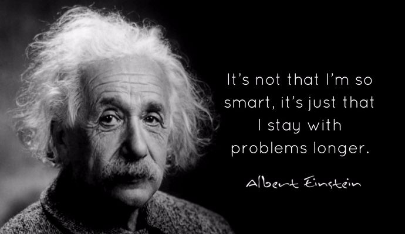
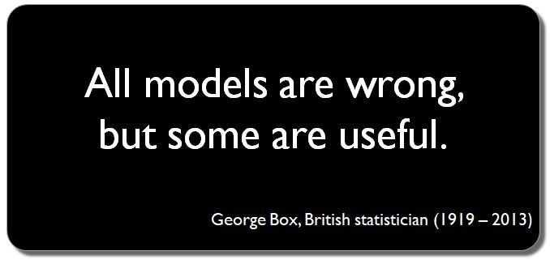

```{r child = "../setup.Rmd"}
```

```{r packages, echo=FALSE, message=FALSE, warning=FALSE}
library(tidyverse)
library(scales)
library(broom)
library(here)
library(rvest)
library(DT)
```

class: center, middle

# What's model?

---

## What's model?

.pull-left[
```{r out.width="90%", fig.align="center", echo=FALSE}

```
]

.pull-right[
```{r out.width="90%", fig.align="center", echo=FALSE}
knitr::include_graphics("img/cow_model.png")
```
]

---

## What's model?

```{r out.width="60%", fig.align="center", echo=FALSE}

```

```{r out.width="60%", fig.align="center", echo=FALSE}

```

---

## We want to explain `y` with `x`

.large[
$$ y = f(x) + e $$
]

- `y`: what we want to model
- `x`: what we want to build a model with
- `f(x)`: how x explains y (model)
- `e`: what model can't explain (random error or noise); gap between model and reality


---

## Examples of model

- we want to explain a person's weight with the average weight of all people in this room:
$$ weight = f(mean) + e $$
- we want to explain a person's weight with the height of the person
$$ weight = f(height) + e $$
- we want to explain a person's weight with the height and nutrition of the person
$$ weight = f(height, nutrition) + e $$
---

## Modeling for prediction vs. statistical inference

.blockquote[
Prediction: I want to predict person's weight as closely as possible. I don't care how many variables to include or what functional form to use. I just want to increase the prediction rate.
]

<br>

.blockquote[
Statistical Inference: the data I have is only a sample of the population. But I want to see if this model and the parameters estimated are applicable to the population as well. 
]

---

## Principal 1: Define your problem

```{r out.width="80%", fig.align="center", echo=FALSE}

```

---

## Principal 1: Define your problem

- which model to use depends on the type of `y`

```{r out.width="50%", fig.align="center", echo=FALSE}
knitr::include_graphics("img/type_of_learning.png")
```

- supervised learning: both `y` and `x` are available
  - discrete `y`: classification
  - continuous `y`: regression (or estimation)
- unsupervised learning to produce output based on pattern of `x`

---

## Principal 2: There is no perfect model

```{r out.width="80%", fig.align="center", echo=FALSE}

```

---

## Principal 2: There is no perfect model

- Which model is better?
- Model validation based on `e`
  - How small is the gap between the model and reality?
  - there is a variety of error metrics for quantifying `e`

```{r out.width="50%", fig.align="center", echo=FALSE}
knitr::include_graphics("img/reg_error.png")
```

---

## Principal 3: Model that fits all

```{r out.width="80%", fig.align="center", echo=FALSE}
knitr::include_graphics("img/under_good_overfit.png")
```

- problem of overfitting: it doesn't fit other data (not generalizable)

---

## Principal 3: Model that fits all

```{r out.width="50%", fig.align="center", echo=FALSE}
knitr::include_graphics("img/bias-variance-tradeoff.png")
```

- model complexity: a model becomes more complex with lots of variables and parameters
- Bias-variance tradeoff
  - bias (`e`) decreases as model complexity
  - variance (sensitivity) increases as model complexity
- Goal is to find the sweet spot where **the total error** is minimal.

---

## Principal 4: Correlation != causation 

```{r echo=FALSE, out.width="100%"}
knitr::include_graphics("img/cell_phones.png")
```

.footnote[
Source: XKCD, [Cell phones](https://xkcd.com/925/)
]

---

class: center, middle

# Data: Paris Paintings

---

## Paris Paintings

.small[
```{r message=FALSE}
pp <- read_csv(
  "data/paris-paintings.csv",
  na = c("n/a", "", "NA")
)
names(pp)
```
]

---

## Auctions today

```{r out.width="90%", fig.align="center", echo=FALSE}
knitr::include_graphics("img/auction-video.png")
```

.tiny[
https://www.youtube.com/watch?v=apaE1Q7r4so
]

---

## Heights

.question[
Describe the distribution of heights of paintings.
]
.small[
```{r height-dist, fig.height=2, fig.width=5, warning=FALSE}
ggplot(data = pp, aes(x = Height_in)) +
  geom_histogram(bins = 30) +
  labs(x = "Height, in inches", y = "")
```
]
---

## Widths

.question[
Describe the distribution of widths of paintings.
]
.small[
```{r width-dist, fig.height=2, fig.width=5, warning=FALSE}
ggplot(data = pp, aes(x = Width_in)) +
  geom_histogram(bins = 30) +
  labs(x = "Width, in inches", y = "")
```
]
---

## Models as functions

- We can represent relationships between variables using **functions**
- A function is a mathematical concept: the relationship between an output
and one or more inputs.
    - Plug in the inputs and receive back the output
    - Example: the formula $y = 3x + 7$ is a function with input $x$ and output $y$,
    when $x$ is $5$, the output $y$ is $22$
    ```
    y = 3 * 5 + 7 = 22
    ```

$$ height = f(width) + e = b_0 + b_1~width + e$$

---

## Visualizing the linear model

.small[
```{r height-width-plot-code, warning = FALSE, fig.height=2.3, fig.width=5}
ggplot(data = pp, aes(x = Width_in, y = Height_in)) +
  geom_point() +
  geom_smooth(method = "lm") # lm for linear model
```
]

---

## ... with different cosmetic choices

.small[
```{r height-width-plot-pink-line, warning = FALSE, fig.height=2.15, fig.width=5}
ggplot(data = pp, aes(x = Width_in, y = Height_in)) +
  geom_point() +
  geom_smooth(method = "lm", 
              col = "pink", lty = 2, lwd = 3)
```
]

---

## Height and width

.small[
```{r}
lm(Height_in ~ Width_in, data = pp)
```
]

--

$$\widehat{height} = 3.62 + 0.78~width$$
$$3.62 + 0.78*10 = 11.42$$

---

## Vocabulary

$$ height = f(width) + e = b_0 + b_1~width + e$$

- **Dependent variable:** Variable whose behavior or variation you are trying to
understand, on the y-axis (response variable)
- **Independent variables:** Other variables that you want to use to explain the
variation in the response, on the x-axis (explanatory variables)
- **Predicted value:** Output of the **model function**
    - The model function gives the typical (expected) value of the response
    variable *conditioning* on the explanatory variables
- **Residuals:** A measure of how far each case is from its predicted value
(`e`)
    - Residual = Observed value - Predicted value
    - Tells how far above/below the expected value each case is

---

## Residuals

.question[
What does a negative residual mean? Which paintings on the plot have have
negative residuals, those below or above the line?
]

```{r height-width-plot-no-se2, warning = FALSE, echo=FALSE, fig.height=2.3, fig.width=5}
m_ht_wt <- lm(Height_in ~ Width_in, data = pp)
m_ht_wt_tidy <- tidy(m_ht_wt)
m_ht_wt_aug <- augment(m_ht_wt)
m_ht_wt_aug <- m_ht_wt_aug %>%
  mutate(res_cat = ifelse(.resid > 0, TRUE, FALSE))

ggplot(data = m_ht_wt_aug) +
  geom_point(aes(x = Width_in, y = Height_in, color = res_cat), alpha=0.2) +
  geom_line(aes(x = Width_in, y = .fitted), size = 0.75, color = "darkgray") +
  labs(
    x = "Width, in inches",
    y = "Height, in inches"
  ) +
  theme(legend.position = "none") +
  scale_color_manual(values = c("darkblue", "lightblue"))
```

---

## Visualizing residuals

```{r echo=FALSE}
ggplot(data=m_ht_wt_aug, mapping = aes(x=Width_in, y=Height_in)) +
  geom_point(alpha=.2) +
  geom_smooth(method = "lm", se=FALSE) +
  geom_segment(mapping = aes(xend = Width_in, yend = .fitted), color="gray", alpha=.2) +
  labs(
    title = "Height vs. width of paintings", 
    subtitle = "Data + least squares resgression line + residuals",
    x = "Width, in inches",
    y = "Height, in inches"
  )
```

---

## Ordinary Least Squares (OLS) regression or estimation

$$ y = b_0 + b_1~x + e $$
$$ \hat{y} = b_0 + b_1~x $$
- The regression line minimizes the sum of squared residuals.
  - $\sum_{i = 1}^n e_i^2 = \sum_{i = 1}^n (y - \hat{y})^2$.

---

## Wrap-up

- what's model
- 4 principals


