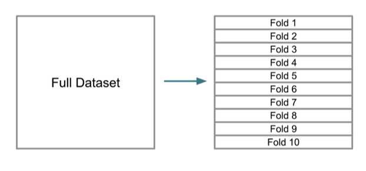
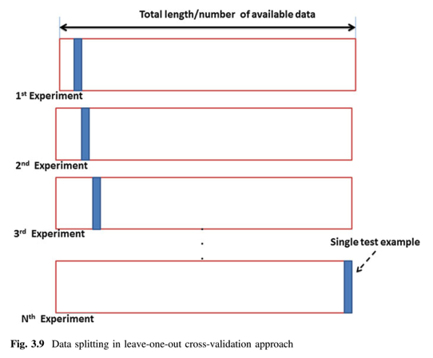

```{r child = "../setup.Rmd"}
```

```{r packages, echo=FALSE, message=FALSE, warning=FALSE}
library(tidyverse)
library(openintro)
library(caret)
library(caTools)

email <- email %>%
  mutate(
    spam = factor(ifelse(spam == 1, "S", "NS")),
    re_subj = factor(re_subj)
  )
```

## Validation

- Analysis framework
  - Problem
  - EDA
  - Modeling
  - Prediction
  - **Validation (Training/Testing split)**

---

## Train/Test split is expensive

- Reserving 20% (or even more) of the data just for testing isn't efficient
- Problematic especially for a small data set
- Single validation: out-of-sample error measured only once
  - What if the test set is outlier?

---
  
## Cross validation (CV)

- Multiple validations instead of one
  - measure out-of-sample errors multiple times and average them out
- Fully utilize data
  - No split necessary

---

## k-fold Cross validation (CV)

```{r out.width="80%", fig.align="center", echo=FALSE}

```

---

## k-fold Cross validation (CV)

```{r out.width="80%", fig.align="center", echo=FALSE}
knitr::include_graphics("img/cv2.png")
```

---
  
## Other CVs

.pull-left[
- Repeated random subsampling (or bootstrap sampling)

```{r out.width="80%", fig.align="center", echo=FALSE}
knitr::include_graphics("img/repeatedcv.png")
```
]

.pull-right[
- Leave-one-out

```{r out.width="80%", fig.align="center", echo=FALSE}

```
]

---

## `train()` from `caret` package
.small[
.pull-left[
```{r}
lm(price ~ carat,
  data = diamonds
)
```
]
.pull-right[
```{r}
dia_caret <- train(
  price ~ carat,
  data = diamonds,
  method = "lm"
)
dia_caret$finalModel
```
- **bootstrap sampling** is used by default
]
]
---

## pick out `train()` output

.small[
```{r}
names(dia_caret)
dia_caret$finalModel # model result
dia_caret$results
```
]

---

## 5-fold Cross validation

```{r eval = FALSE}
dia_caret_cv5 <- train(
  price ~ carat,
  data = diamonds,
  method = "lm",
  trControl = trainControl( #<<
    method = "cv",
    number = 5
  )
)
dia_caret_cv5
```

---

## 5-fold Cross validation

```{r eval = FALSE}
dia_caret_cv5 <- train(
  price ~ carat,
  data = diamonds,
  method = "lm",
  trControl = trainControl(
    method = "cv", #<<
    number = 5 #<<
  )
)
dia_caret_cv5
```

---

## 5-fold Cross validation

```{r echo = FALSE}
dia_caret_cv5 <- train(
  price ~ carat,
  data = diamonds,
  method = "lm",
  trControl = trainControl( #<<
    method = "cv",
    number = 5
  )
)
dia_caret_cv5
```

---
  
## 10-fold cross validation

.small[
```{r}
dia_caret_cv10 <- train(
  price ~ carat,
  data = diamonds,
  method = "lm",
  trControl = trainControl(
    method = "cv",
    number = 10 #<<
  )
)
dia_caret_cv10
```
]

---

## Leave one out CV

- Warning: it's really time-consuming

```{r eval = FALSE}
dia_caret_loo <- train(
  price ~ carat,
  data = diamonds,
  method = "lm",
  trControl = trainControl(
    method = "LOOCV" #<<
  )
)
dia_caret_loo
```

---

## Logistic regression using `train()`

.small[
.pull-left[
```{r}
glm(spam ~ num_char,
  data = email,
  family = "binomial"
)
```
]

.pull-right[
```{r}
spam_caret <- train(
  spam ~ num_char,
  data = email,
  method = "glm"
)
spam_caret$finalModel
```

]

]
---

## Logistic regression with CV
.small[
```{r warning = FALSE}
spam_caret_cv10 <- train(
  spam ~ .,
  data = email,
  method = "glm",
  trControl = trainControl(
    method = "cv",
    number = 10
  )
)
spam_caret_cv10
```
]
---

## AUC as metric instead of accuracy
.small[
```{r warning = FALSE}
spam_caret_cv10_auc <- train(
  spam ~ .,
  data = email,
  method = "glm",
  trControl = trainControl(
    method = "cv",
    number = 10,
    summaryFunction = twoClassSummary, #<<
    classProbs = TRUE #<<
  )
)
spam_caret_cv10_auc
```
]

---

## Wrap up

- `train()`
- Cross-validation
  - k-fold
  - random sampling
  - leave one out