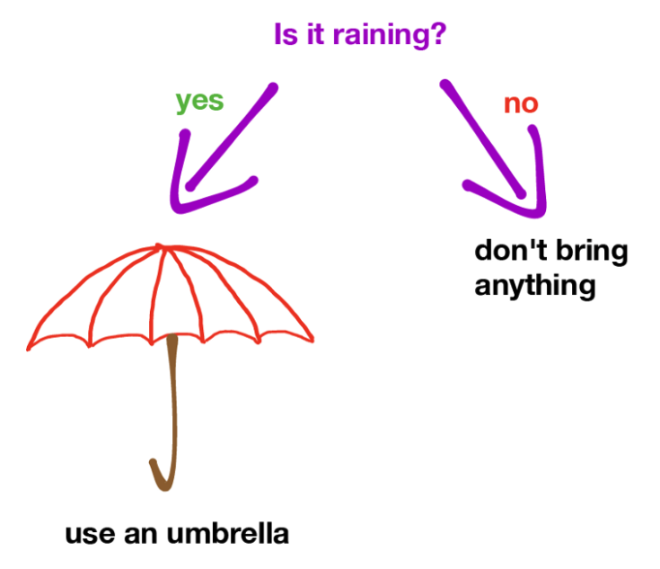
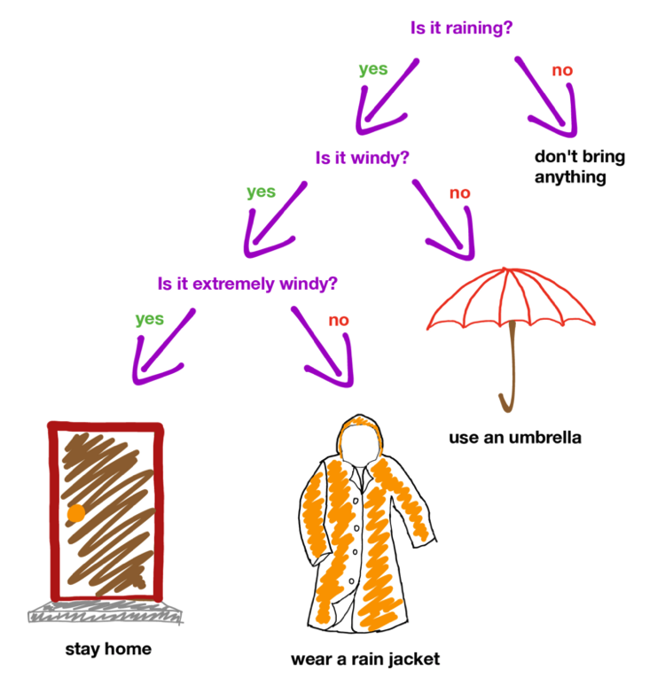
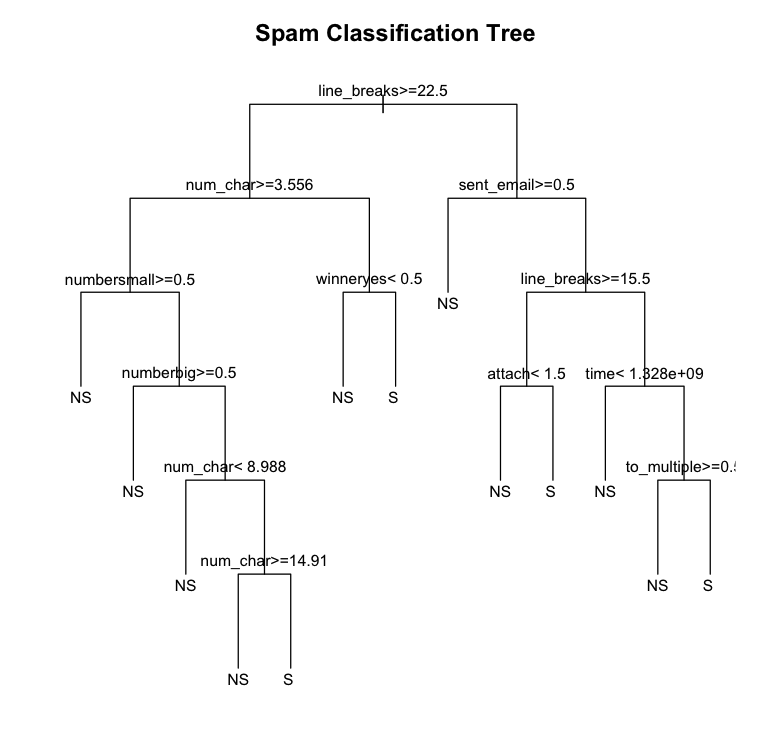
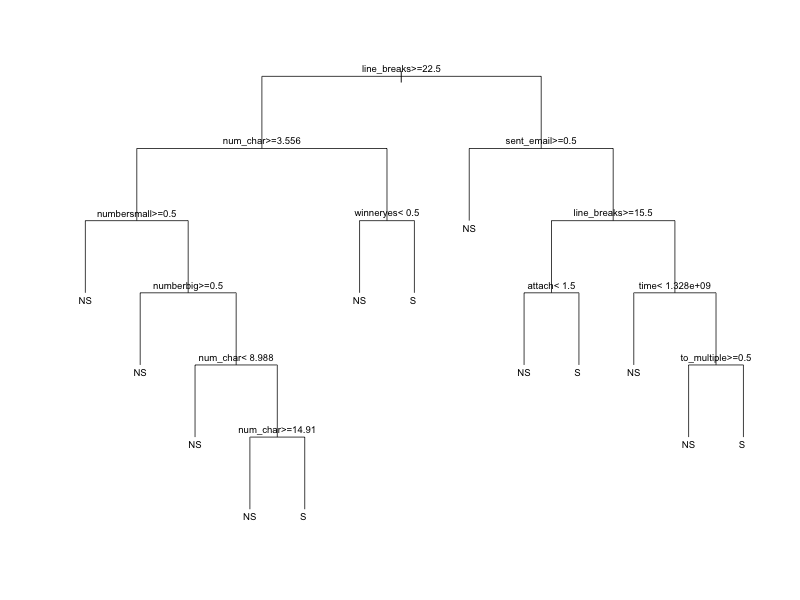
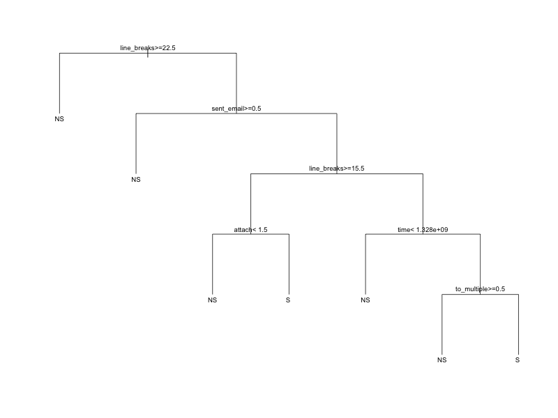

```{r child = "../setup.Rmd"}
```


```{r packages, echo=FALSE, message=FALSE, warning=FALSE}
library(tidyverse)
library(openintro)
library(caret)
library(caTools)

email <- email %>%
  mutate(
    spam = factor(ifelse(spam == 1, "S", "NS")),
    re_subj = factor(re_subj)
  )

```

```{r out.width="60%", fig.align="center", echo=FALSE}

```

.small[
.footnote[https://medium.com/@ml.at.berkeley/machine-learning-crash-course-part-5-decision-trees-and-ensemble-models-dcc5a36af8cd]
]
---
  
```{r out.width="60%", fig.align="center", echo=FALSE}

```
.small[
.footnote[https://medium.com/@ml.at.berkeley/machine-learning-crash-course-part-5-decision-trees-and-ensemble-models-dcc5a36af8cd]
]
---
  
## Who I am = Decision tree

.pull-left[
- The goal is to guess who the person is
- Ask as many questions as you want
- But whoever gets it first is the winner
]

.pull-right[
- The goal is to classify samples
- Put as many conditions as you want to perfectly classify (or separate) samples
- But the fewer conditions the better

]

---
  
## Decition tree

- Start from the root: "is it raining?"
- Grow the tree
  - branch: Yes or no
  - leave: is it windy? is it extremely windy?
- The goal is for all leaves to perfectly separate or classify samples
  - classes: "stay home", "wear a rain jacket", "use an umbrella", "don't bring an umbrella"

---

```{r out.width="80%", fig.align="center", echo=FALSE}

```

---
  
## Spam filters

We will examine a data set of emails where we are interested in identifying 
spam messages. 

- `openintro` package
- Data from 3921 emails and 21 variables on them.
- The outcome is whether the email is spam or not.

```{r echo=FALSE}
table(email$spam)
```

---

## Let's grow some trees

.small[
```{r}
set.seed(123)
mod_tree <- train(
  spam ~ .,
  data = email,
  method = "rpart", #<<
  trControl = trainControl(
    method = "cv",
    number = 10
  )
)
mod_tree
```
]
---

## Plot the tree

```{r eval = FALSE}
# plot the model
plot(mod_tree$finalModel, uniform = TRUE)
text(mod_tree$finalModel, cex = .8)
```

```{r echo = FALSE, eval = FALSE, message = FALSE, warning = FALSE}
# plot the model
png(file = "lecture/w12-decision-tree/img/tree_best.png", width = 800, height = 600)
plot(mod_tree$finalModel, uniform = TRUE)
text(mod_tree$finalModel, use.n. = TRUE, cex = .8)
dev.off()
```

---

```{r out.width="100%", fig.align="center", echo=FALSE}

```

---

## Split rules

- Tree splits such that the resulting leaves can separate as many samples as possible 
- Metrics
  - Entropy
  - Gini coefficient

---

class: center, middle

# Improve prediction

---

## Too many branches

.small[
- Tree is too tall = Overfitting
- Complexity Parameter or CP to measure the extent
  - the higher the CP, the smaller the tree (less complex or overfitted)
- `train()` grows three trees (three CPs) by default

```{r}
mod_tree
```
]

---

## Tree with CP = 0.03

```{r echo = FALSE, eval = FALSE}
mod_tree_cp03 <- train(
  spam ~ .,
  data = email,
  method = "rpart",
  trControl = trainControl(
    method = "cv",
    number = 10
  ),
  tuneGrid = data.frame(cp = 0.03) # <<
)
png(file = "lecture/w12-decision-tree/img/tree_worst.png", width = 800, height = 600)
plot(mod_tree_cp03$finalModel, uniform = TRUE)
text(mod_tree_cp03$finalModel, cex = .8)
dev.off()
```

```{r out.width="100%", fig.align="center", echo=FALSE}

```

---

## Compare accuracy across CPs

- `tuneLength` to set the number of trees (or CPs) to grow
  - the higher the CP, the smaller the tree
  - the lower the CP, the taller the tree

```{r}
mod_trees <- train(
  spam ~ .,
  data = email,
  method = "rpart",
  trControl = trainControl(
    method = "cv",
    number = 10
  ),
  tuneLength = 10 #<<
)
```

---
.small[
```{r}
mod_trees
```
]
---
.small[
```{r out.width="75%"}
plot(mod_trees)
mod_trees$bestTune
```
]
---

## Class imbalance

- "needle in a haystack" problem
- ML algorithms tend to ignore minority examples

```{r echo = FALSE, out.width="80%"}
ggplot(email, aes(x = spam)) +
  geom_bar()
```

---

## Rebalance it by re-sampling data set

```{r out.width="80%", fig.align="center", echo=FALSE}
knitr::include_graphics("img/sampling.png")
```

- Up (or over): randomly replicate instances in the minority class
- Down (or under): randomly remove instances in the majority class
- and more ...

---

## e.g., Upsampling (Oversampling)

- `sampling` to change the sampling method
  - `up`, `down`

```{r}
set.seed(123)
mod_tree_up <- train(
  spam ~ .,
  data = email,
  method = "rpart",
  trControl = trainControl(
    method = "cv",
    number = 10,
    sampling = "up" #<<
  )
)
```

```{r echo = FALSE}
set.seed(123)
mod_tree_down <- train(
  spam ~ .,
  data = email,
  method = "rpart",
  trControl = trainControl(
    method = "cv",
    number = 10,
    sampling = "down" #<<
  )
)
```


---
  
## Wrap up

- Decision tree classification
- Complexity of tree
- Sampling method