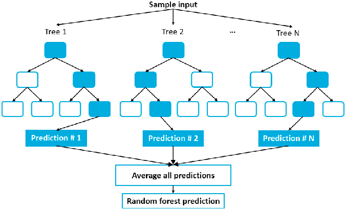
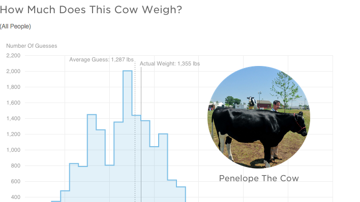

```{r child = "../setup.Rmd"}
```


```{r packages, echo=FALSE, message=FALSE, warning=FALSE}
library(tidyverse)
library(openintro)
library(caret)
library(caTools)

email <- email %>%
  mutate(
    spam = factor(ifelse(spam == 1, "S", "NS")),
    re_subj = factor(re_subj)
  ) %>% 
  drop_na()

```


.pull-left[
```{r out.width="100%", fig.align="center", echo=FALSE}
knitr::include_graphics("img/tree2.png")
```
]
.small[
.pull-right[
- Start from the root: "is it raining?"
- Grow the tree
  - branch: Yes or no
  - leave: is it windy? is it extremely windy?
- The goal is for all leaves to perfectly separate or classify samples
  - classes: "stay home", "wear a rain jacket", "use an umbrella", "don't bring an umbrella"
]
]
.small[
.footnote[https://medium.com/@ml.at.berkeley/machine-learning-crash-course-part-5-decision-trees-and-ensemble-models-dcc5a36af8cd]
]

---

.pull-left[
```{r out.width="100%", fig.align="center", echo=FALSE}
knitr::include_graphics("img/tree2.png")
```
]
.pull-right[
```{r out.width="100%", fig.align="center", echo=FALSE}
knitr::include_graphics("img/tree2.png")
```
]

---

  
## Random forest: Grow a bunch of trees!

- Build (grow) more than one models (trees) and aggreate the predictions
  - At the end, each model votes, and the majority of the votes becomes the collective prediction
- Ensemble method: Combination of models (in this case trees)


```{r out.width="60%", fig.align="center", echo=FALSE}

```


---

## Wisdom of crowds

.pull-left[
```{r out.width="75%", fig.align="center", echo=FALSE}
knitr::include_graphics("img/wisdom-of-crowds.jpg")
```
]
.pull-right[
```{r out.width="100%", fig.align="center", echo=FALSE}

```

- Many weak guesses to come together to make a strong prediction
- Only works when individual opinions are **independent**

]


---

## Growing trees that are independent

- Bagging (Bootstrap aggregation)
  - grow each tree based on a random subsample of data
- Random feature selection
  - limit a subset of features of variables as possible candidates to split upon

---

## Bagging (Bootstrap aggregation)

```{r out.width="50%", fig.align="center", echo=FALSE}
knitr::include_graphics("img/bagging.jpeg")
```

.footnote[https://medium.com/machine-learning-through-visuals/machine-learning-through-visuals-part-1-what-is-bagging-ensemble-learning-432059568cc8]
---

## Random feature selection

```{r out.width="100%", fig.align="center", echo=FALSE}
knitr::include_graphics("img/feature-selection.jpg")
```

.footnote[https://blog.quantinsti.com/random-forest-algorithm-in-python/]
---
  
## Spam filters

We will examine a data set of emails where we are interested in identifying 
spam messages. 

- `openintro` package
- Data from 3921 emails and 21 variables on them.
- The outcome is whether the email is spam or not.

```{r echo=FALSE}
table(email$spam)
```

---

## Spam filter random forest

- Install package `ranger`

```{r eval = FALSE}
set.seed(123)
mod_forest <- train(
  spam ~ .,
  data = email,
  tuneLength = 1, #<<
  method = "ranger", #<<
  trControl = trainControl(
    method = "cv",
    number = 10
  )
)
```

---

## Spam filter random forest

- Install package `ranger`

```{r eval = FALSE}
set.seed(123)
mod_forest <- train(
  spam ~ .,
  data = email,
  tuneLength = 1,
  method = "ranger",
  trControl = trainControl( #<<
    method = "cv", #<<
    number = 10 #<<
  )
)
```

---

## Spam filter random forest

```{r echo=FALSE, cache = TRUE}
set.seed(123)
mod_forest <- train(
  spam ~ .,
  data = email,
  tuneLength = 1, #<<
  method = "ranger", #<<
  trControl = trainControl(
    method = "cv",
    number = 10
  )
)
```

.small[
```{r}
mod_forest
```
]

---

## Tuning hyperparameter

- `mtry`: number of randomly selected features used at each split
- Low `mtry`: more random
- High `mtry`: less random
- Set `tuneLength` to randomly search different values of `mtry`
  
```{r eval = FALSE}
set.seed(123)
mod_forests <- train(
  spam ~ .,
  data = email,
  tuneLength = 10, # <<
  method = "ranger",
  trControl = trainControl(
    method = "cv",
    number = 10
  )
)
```

---

```{r echo = FALSE, cache = TRUE}
set.seed(123)
mod_forests <- train(
  spam ~ .,
  data = email,
  tuneLength = 10, # <<
  method = "ranger",
  trControl = trainControl(
    method = "cv",
    number = 10
  )
)
```
.small[
```{r}
mod_forests
```
]
---
  
```{r}
plot(mod_forests)
```

---

## Logistic regression and single tree

.small[
.pull-left[
```{r warning = FALSE, message = FALSE}
# Logistic regression
spam_caret_cv10 <- train(
  spam ~ .,
  data = email,
  method = "glm", #<<
  trControl = trainControl(
    method = "cv",
    number = 10
  )
)
spam_caret_cv10
```
]

.pull-right[
```{r warning = FALSE, message = FALSE}
# Decision tree
set.seed(123)
mod_tree <- train(
  spam ~ .,
  data = email,
  method = "rpart", #<<
  trControl = trainControl(
    method = "cv",
    number = 10
  )
)
mod_tree
```
]
]
---

## Compare out-of-sample accuracy across models

```{r}
spam_caret_cv10$results$Accuracy # Logistic regression
max(mod_tree$results$Accuracy) # Single tree
max(mod_forests$results$Accuracy) # Random forest
```

---
  
## Wrap up

- Random forest
- Bagging
- Random feature selection
- Gradient Boosting Machine (GBM)