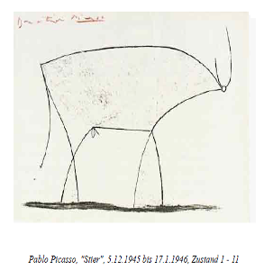

```{r child = "../setup.Rmd"}
```

```{r packages, echo=FALSE, message=FALSE, warning=FALSE}
library(tidyverse)
library(broom)
library(openintro)
library(caret)

hotels <- read_csv("data/hotels.csv")

x <- tibble(value = c(1, 2, 3))
y <- tibble(value = c(1, 2, 4))

email <- email %>%
  mutate(
    spam = factor(spam),
    re_subj = factor(re_subj)
  )

set.seed(123)
splitratio <- 0.8
index <- createDataPartition(email$spam, p = splitratio, list = FALSE)
train <- email[index, ]
test <- email[-index, ]
```

# Review

- R essentials
- Data wrangling
- Data visualization
- Data modeling
- Before you go

---

class: middle, center

# R essentials (Week 1, 2)

---

## Let's take a tour - RStudio

```{r fig.align="center", echo=FALSE, alt="rstudio", out.width="90%"}
knitr::include_graphics("img/rstudio-anatomy.png")
```

---

## Three essentials: Variable, function, package

A short list (for now):

- Variables or columns in data frames are accessed with `$`:

.small[
```{r eval=FALSE}
dataframe$var_name
```
]

- Functions are (most often) verbs, followed by what they will be applied to in parantheses:

.small[
```{r eval=FALSE}
do_this(to_this)
do_that(to_this, to_that, with_those)
```
]

- Packages are installed with the `install.packages` function and loaded with the `library` function, once per session:

.small[
```{r eval=FALSE}
install.packages("package_name")
library(package_name)
```
]
---

## Let's take a tour - R Markdown

.center[

]

---

class: middle, center

# Data wrangling (Week 4, 6, 7)

---

## A grammar of data wrangling...

... based on the concepts of functions as verbs that **manipulate** data frames

.pull-left[
```{r dplyr-part-of-tidyverse, echo=FALSE, out.width="80%", fig.align = "center", caption = "dplyr is part of the tidyverse"}
knitr::include_graphics("img/dplyr-part-of-tidyverse.png")
```
]
.pull-right[
.midi[
- `select`: pick columns by name
- `arrange`: reorder rows
- `slice`: pick rows using index(es)
- `filter`: pick rows matching criteria
- `distinct`: filter for unique rows
- `mutate`: add new variables
- `summarise`: reduce variables to values
- `group_by`: for grouped operations
- ... (many more)
]
]

---

## What is a pipe %>%?

In programming, a pipe is a technique for passing information from one process to another.

.pull-left[
- Start with the data frame `hotels`, and pass it to the `select()` function,
- then we select the variables `hotel` and `lead_time`,
- and then we arrange the data frame by `lead_time` in descending order.
]
.pull-right[
.small[
```{r}
hotels %>%
  select(hotel, lead_time) %>% 
  arrange(desc(lead_time)) #<<
```
]
]

---
## Joining data frames

```
something_join(x, y)
```

- `inner_join()`: all rows from x where there are matching values in y, return 
all combination of multiple matches in the case of multiple matches
- `left_join()`: all rows from x
- `right_join()`: all rows from y
- `full_join()`: all rows from both x and y
- `semi_join()`: all rows from x where there are matching values in y, keeping just columns from x.
- `anti_join()`: return all rows from x where there are not matching values in y, never duplicate rows of x
- ...

---

## `inner_join()`

.pull-left[
```{r}
inner_join(x, y)
```
]
.pull-right[
```{r echo=FALSE}
knitr::include_graphics("img/inner-join.gif")
```
]

---

## `pivot_longer()`

```{r echo=FALSE, out.width="100%", fig.align = "center"}
knitr::include_graphics("img/tidy-pivot-long.png")
```

---

## `pivot_wider()` for the opposite

```{r echo=FALSE, out.width="100%", fig.align = "center"}
knitr::include_graphics("img/tidy-pivot-wide.png")
```

---

## readr

- `read_csv()` - comma delimited files
- `read_csv2()` - semicolon separated files (common in countries where , is used as the decimal place)
- `read_tsv()` - tab delimited files
- `read_delim()` - reads in files with any delimiter
- `read_fwf()` - fixed width files
- `read_table()` - common variation of fixed width files where columns are separated by white space
- ...


---

class: middle, center

# Data visualization (Week 3, 5)

---

## Hello ggplot2!

- `ggplot()` is the main function in ggplot2 
- Plots are constructed in layers
- Structure of the code for plots can be summarized as
```{r eval = FALSE}
ggplot(data = [dataset], 
       mapping = aes(x = [x-variable], y = [y-variable])) +
   geom_xxx() +
   other options
```
- To use ggplot2 functions, first load tidyverse
```{r eval = FALSE}
library(tidyverse)
```
- For help with the ggplot2, see [ggplot2.tidyverse.org](http://ggplot2.tidyverse.org/)

---


.small[
.footnote[[The R Graph Gallery](https://www.r-graph-gallery.com/index.html)]
]

---

class: middle, center

# Data modeling (Week 8, 10, 11, 12, 13)

---

## What's model?

.pull-left[
```{r out.width="90%", fig.align="center", echo=FALSE}
knitr::include_graphics("img/cow_real.png")
```
]

.pull-right[
```{r out.width="90%", fig.align="center", echo=FALSE}

```
]

---


## We want to explain `y` with `x`

.large[
$$ y = f(x) + e $$
]

- `y`: what we want to model
- `x`: what we want to build a model with
- `f(x)`: how x explains y (model)
- `e`: what model can't explain (random error or noise); gap between model and reality

---

## Relationship between price and carat
.small[
```{r}
model <- lm(price~carat, data = diamonds)
summary(model)
```
]

---

## Spam model

```{r}
spam_model <- glm(spam ~ num_char, data = train, family = "binomial")
tidy(spam_model)
```
  
Model:
$$\log\left(\frac{p}{1-p}\right) = -1.75-0.0702\times \text{num_char}$$

---

## Confusion matrix

.small[
|                         | Email is spam                 | Email is not spam             |
|-------------------------|-------------------------------|-------------------------------|
| Email labelled spam     | True Positive                 | False Positive (Type 1 error) |
| Email labelled not spam | False Negative (Type 2 error) | True Negative                 |
]

.small[
- Accuracy = (TP + TN) / (TP + FP + FN + TN)
- Sensitivity = P(Labelled spam | Email spam) = TP / (TP + FN)
  - Sensitivity = 1 − False negative rate
- Specificity = P(Labelled not spam | Email not spam) = TN / (FP + TN) 
  - Specificity = 1 − False positive rate
]

---

## ROC curves for the best and worst

```{r out.width="50%", fig.align="center", echo=FALSE}
knitr::include_graphics("img/roc-curve-v2.png")
```

- Area under the curve (AUC) (from 0 to 1)
  - 0.5 : random guessing
  - 1 : model always right

---

.pull-left[
```{r out.width="100%", fig.align="center", echo=FALSE}
knitr::include_graphics("img/tree2.png")
```
]
.small[
.pull-right[
- Start from the root: "is it raining?"
- Grow the tree
  - branch: Yes or no
  - leave: is it windy? is it extremely windy?
- The goal is for all leaves to perfectly separate or classify samples
  - classes: "stay home", "wear a rain jacket", "use an umbrella", "don't bring an umbrella"
]
]
.small[
.footnote[https://medium.com/@ml.at.berkeley/machine-learning-crash-course-part-5-decision-trees-and-ensemble-models-dcc5a36af8cd]
]

---

.pull-left[
```{r out.width="100%", fig.align="center", echo=FALSE}
knitr::include_graphics("img/tree2.png")
```
]
.pull-right[
```{r out.width="100%", fig.align="center", echo=FALSE}
knitr::include_graphics("img/tree2.png")
```
]
---

## In-sample error vs. out-of-sample error

.small[
- We have used the same dataset for training and testing the model, which is cheating
- Prone to over-fitting (Principal #3)
  - Overfitted models won't work well on **new data**

```{r out.width="80%", fig.align="center", echo=FALSE}
knitr::include_graphics("img/under_good_overfit.png")
```

- In-sample error: estimated errors from the data used for training
- Out-of-sample error: estimated errors from the data never used for training
]

---

## k-fold Cross validation (CV)

```{r out.width="80%", fig.align="center", echo=FALSE}
knitr::include_graphics("img/cv2.png")
```

---

class: middle, center

# Before you go

---

## Types of Machine Learning Methods

- **Supervised learning for labeled data**
  - **Regression** (**Linear**, **Logistic**, glmnet)
  - **Classification** (**Trees**, Support vector, Neural net)
- Unsupervised learning for unlabeled data*
  - Clustering (k-mean)
  - Dimension reduction (Embedding, SVD, PCA)

---

## Math behind it

- To look under the hood
  - Linear algebra
  - Optimization
  - Statistic
- ML = framework to model and solve problems that have no closed-form solutions.
$$ y = x^2 $$
$$ erf(a) = \frac{2}{\sqrt{\pi}} \int_0^{a} e^{-x^2} ~ dx $$
- So instead, we use optimization techniques to find close-enough solutions
---

## Deep Learning

.pull-left[
- Multilayer Neural Network
  - scalibility
  - hierarchical learning (learning and abstraction)
  - applicability (image, voice)

```{r out.width="100%", fig.align="center", echo=FALSE}
knitr::include_graphics("img/deep-learning.png")
```
]
.pull-right[
- Prominent applications
  - Deep reinforcement learining (Alpha Go)
  - Convolutional neural net (Image classification)
  - Long Short-Term Memory Recurrent Neural Networks or LSTM (Stock market prediction)
]

---

## [Tensorflow Playground](https://playground.tensorflow.org)

```{r out.width="100%", fig.align="center", echo=FALSE}
knitr::include_graphics("img/tf-playground.gif")
```

---

class: center, middle

# Thank you! `r emo::ji('tada')` `r emo::ji('fireworks')`